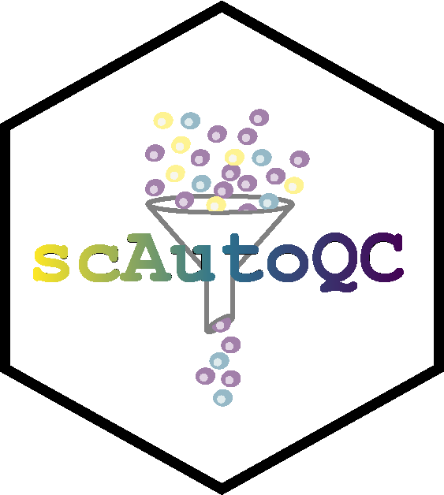

# sctk

**S**ingle **C**ell analysis **T**ool **K**it: A large collection of functions built around the scanpy ecosystem that faciliates preprocessing, clustering, annotation, integration and some down-stream analysis of scRNA-seq data.

## Installation

```bash
pip install sctk
```

If you encounter dependency clashes, create a fresh python 3.9 virtual environment (e.g. via conda) and install SCTK there. It may also help to update pip:

```bash
pip install --upgrade pip
```

## Usage and Documentation

SCTK's documentation is available [here](https://sctk.readthedocs.io/en/latest/), and features a tutorial and API reference for scAutoQC (an automated QC workflow).

